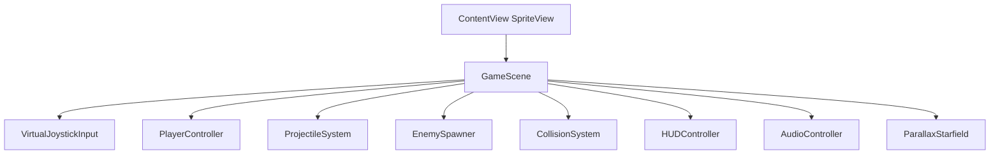

# Galaxy Monkey iOS Build Plan

## Direction

Build Galaxy Monkey as an iOS SpriteKit app, not Phaser. Treat [OG_PLAN.md](/Users/minasaleeb/workspaces/GalaxyMonkey/OG_PLAN.md) as the gameplay seed: twin-stick movement, right-stick auto-fire, enemy spawning, simple circular collisions, lives, score, invincibility flicker, and parallax space polish.

Use PenguinSlide as the implementation pattern source: XcodeGen project setup, SwiftUI `SpriteView` host, SpriteKit `GameScene` orchestrator, small subsystem files, asset catalog loading, bundled `Sounds/`, run/test scripts, and docs/blog-style decision notes.

## Phase 0: Repo Reset And App Identity

- Confirm the working tree deletion state is intentional, because GalaxyMonkey is currently a PenguinSlide clone mid-pivot with most app files deleted.
- Create a new XcodeGen `project.yml` for a `GalaxyMonkey` iOS target and `GalaxyMonkeyUITests` target.
- Add app shell files under `GalaxyMonkey/`: `GalaxyMonkeyApp.swift`, `ContentView.swift`, `GameScene.swift`, `Info.plist`, `PrivacyInfo.xcprivacy`, `LaunchScreen.storyboard`, and `Assets.xcassets`.
- Rebrand scripts and docs away from PenguinSlide: `run-sim.sh`, `run-device.sh`, `test-smoke.sh`, `test-xcui.sh`, `README.md`, `TESTING.md`, and release scripts in `scripts/`.

## Phase 1: Playable Controls Prototype

- Implement a placeholder-only playable loop first, matching `OG_PLAN.md` lines 7-73.
- Add dynamic virtual joysticks: left half controls translation, right half controls aim and firing. Use dead zones, per-touch tracking, and visible joystick rings/thumbs.
- Build `PlayerController` around velocity, drag, aim angle, fire cooldown, lives, and brief invulnerability.
- Build `ProjectileSystem` with pooled bullets, constant velocity, time-to-live cleanup, and simple contact categories.
- Build `EnemySpawner` that spawns outside the camera bounds and moves enemies toward the player.
- Build `HUDController` for score, level/wave, lives, pause, start, game over, and restart.

## Phase 2: Game Architecture

SpriteKit structure should mirror PenguinSlide's subsystem split while adapting controls:

Key runtime files to create:

- [GalaxyMonkey/GameScene.swift](/Users/minasaleeb/workspaces/GalaxyMonkey/GalaxyMonkey/GameScene.swift) as orchestration only.
- [GalaxyMonkey/VirtualJoystick.swift](/Users/minasaleeb/workspaces/GalaxyMonkey/GalaxyMonkey/VirtualJoystick.swift) for touch ownership and vector output.
- [GalaxyMonkey/Player.swift](/Users/minasaleeb/workspaces/GalaxyMonkey/GalaxyMonkey/Player.swift) for movement, aim, health, and ship animation hooks.
- [GalaxyMonkey/ProjectileSystem.swift](/Users/minasaleeb/workspaces/GalaxyMonkey/GalaxyMonkey/ProjectileSystem.swift) for bullet and enemy projectile pools.
- [GalaxyMonkey/EnemySystem.swift](/Users/minasaleeb/workspaces/GalaxyMonkey/GalaxyMonkey/EnemySystem.swift) for monkeys, gorilla boss, waves, and spawn pacing.
- [GalaxyMonkey/SpriteCatalog.swift](/Users/minasaleeb/workspaces/GalaxyMonkey/GalaxyMonkey/SpriteCatalog.swift) for named textures and nearest/linear filtering decisions.
- [GalaxyMonkey/AudioController.swift](/Users/minasaleeb/workspaces/GalaxyMonkey/GalaxyMonkey/AudioController.swift) for music and SFX.
- [GalaxyMonkey/Tuning.swift](/Users/minasaleeb/workspaces/GalaxyMonkey/GalaxyMonkey/Tuning.swift) for control, projectile, enemy, audio, and wave constants.

## Phase 3: Asset Pipeline

Keep [sprite-pipeline/spritecook-assets.json](/Users/minasaleeb/workspaces/GalaxyMonkey/sprite-pipeline/spritecook-assets.json) as the SpriteCook source of truth and extend it with `asset_path`, `role`, `sha12_local`, frame metadata, and notes. Fix the docs mismatch where [sprite-pipeline/README.md](/Users/minasaleeb/workspaces/GalaxyMonkey/sprite-pipeline/README.md) describes Phaser/public paths.

Initial import should use the existing normalized legacy sprites from [sprite-pipeline/normalized](/Users/minasaleeb/workspaces/GalaxyMonkey/sprite-pipeline/normalized) so the game can ship placeholders with real silhouettes. Then generate HD replacements in priority order:

- Player ship: reuse existing `player_ship_canonical` asset id from the manifest before generating anything new.
- Enemy monkeys: preppy, white, shady left/right variants, using reference assets for consistency.
- Gorilla boss: canonical still plus idle/attack spritesheet.
- Projectiles and pickups: player bullet, enemy bullet, bomb, banana, rotten banana.
- FX: thrust, explosion spritesheet, black hole, starfield/space backdrop, pause/life/title UI.

SpriteCook rules during execution:

- Check credit balance before a batch.
- Generate canonical stills once, save `asset_id` immediately, then use `reference_asset_id` or animation from the same id.
- Prefer `pixel: false` for the current legacy-HD art direction, transparent backgrounds, `smart_crop_mode: tightest`, and `gemini-3.1-flash-image-preview` unless we intentionally optimize cost.
- Download outputs into `GalaxyMonkey/Assets.xcassets/<Name>.imageset/` or animation folders with predictable names.

## Phase 4: Audio And Music Pipeline

Create `GalaxyMonkey/Sounds/` and a small media manifest parallel to the SpriteCook manifest, e.g. [media-assets.json](/Users/minasaleeb/workspaces/GalaxyMonkey/media-assets.json).

Generate SFX with ElevenLabs sound effects after gameplay events exist so each sound has a concrete timing target:

- Player shot, enemy shot, bomb throw, explosion, pickup, player hit, shield/invulnerability, wave start, game over, UI tap.

Generate music with ElevenLabs music after the visual identity is stable:

- Main loop: 45-60s seamless arcade space loop.
- Menu loop: shorter lighter variation.
- Boss/wave intensity sting or loop.

Convert generated audio to `.caf` for iOS bundle use, following PenguinSlide's bundled `Sounds/` pattern.

## Phase 5: Replace Placeholders With Assets

- Add `GalaxySprite` enum names that match asset catalog image set names.
- Load all textures through `SpriteCatalog` and preload on scene start.
- Replace primitive player/enemy/projectile nodes with textures one system at a time.
- Handle non-uniform legacy animation frames explicitly; do not assume fixed-grid spritesheets for old explosion/gorilla frames unless SpriteCook outputs a uniform sheet.
- Preserve gameplay scale with tuning constants instead of resizing art ad hoc in every node.

## Phase 6: Feel, Progression, And Testing

- Tune joystick radius, dead zone, drag, max speed, fire interval, projectile speed, enemy spawn cadence, enemy HP, and invulnerability duration.
- Add waves/levels: start with spawn-rate and enemy-mix progression before adding boss patterns.
- Add haptics for shot, pickup, hit, explosion, and game over.
- Add XCTest/XCUITest smoke coverage: app launches, start game, joystick debug hooks move player, firing increments projectile count, restart works.
- Add agent-device dogfood pass on simulator/device once playable.

## Phase 7: Documentation And Release Prep

- Replace stale PenguinSlide docs with GalaxyMonkey setup, gameplay, asset pipeline, and testing docs.
- Add `docs/blog/00-bootstrapping-galaxy-monkey.md`, `01-twin-stick-controls.md`, `02-spritecook-asset-pipeline.md`, `03-arcade-audio-layering.md`, and `04-wave-tuning.md` if blog parity is desired.
- Prepare App Store metadata only after the core loop and visual identity are stable.

## First Implementation Slice

After approval, the first executable slice should be:

1. Recreate the iOS project shell and build scripts.
2. Add a SpriteKit scene with placeholder twin-stick controls.
3. Add player movement, aiming, bullet firing, one enemy spawner, score/lives, and restart.
4. Only then import legacy normalized sprites into `Assets.xcassets` and start SpriteCook/ElevenLabs generation batches.